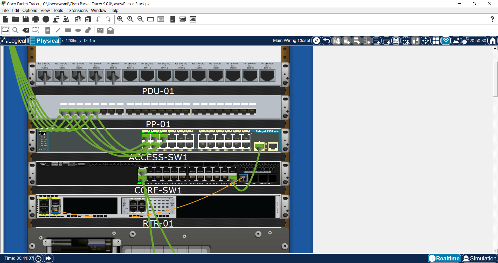
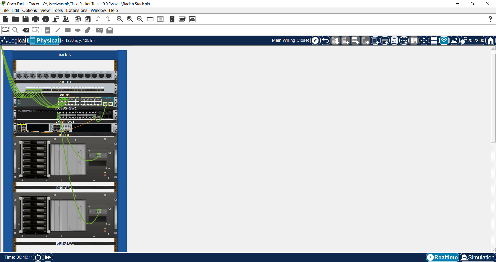
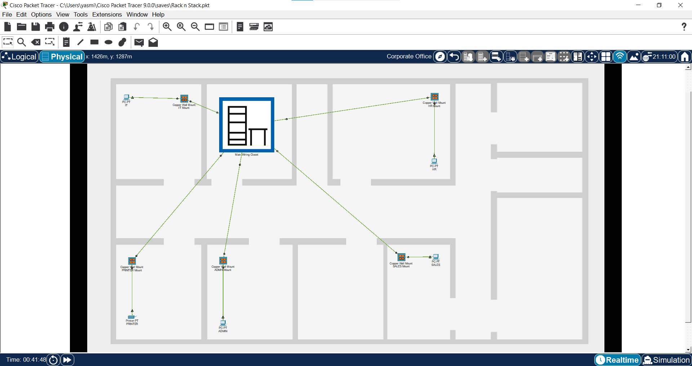

# Small-Enterprise-Rack-Design
Structured cabling and rack-and-stack lab demonstrating patch panels, wall jacks, fiber uplinks, SFP transceivers, and enterprise network infrastructure design.

Demonstrated Skills
- Rack and stack 
- Structured cabling
- Copper Ethernet cabling
- Wall jack deployment
- Punchdown terminations
- Patch panel connectivity
- SFP transceiver installation
- Fiber optic uplinks
- Layer 1 troubleshooting
- Network infrastructure documentation

Rack Components
- PDU-01
- PP-01
- ACCESS-SW1
- CORE-SW1
- RTR-01
- DNS-SRV1
- FILE-SRV1

Structured Cabling Workflow
- End Device -> Wall Jack -> Patch Panel -> Access Switch -> Core Switch -> Router
  
Fiber Infrastructure
  In order to simulate a realistic enterprise and data center environment, fiber optic uplinks were deployed between core network infrastructure devices. Cisco GLC-LH-SMD Small Form-Factor Pluggable (SFP) transceiver modules installed in the multilayer switch and router to provide fiber connectivity. Unlike endpoint devices such as workstations, printers, and laptops, which commonly utilize copper Ethernet cabling, infrastructure devices often communicate through dedicated backbone links. These backbone connections support traffic flow from multiple users and network segments, making fiber the most ideal medium, having high bandwidth capacity, reliability, and support for longer distances.

## Rack Close Up

This close-up view highlights the physical cabling and port-level connections within the rack, showing structured cable management between switches, patching, and device interfaces.

## Full Rack View

This full rack view provides an overview of the overall network infrastructure, illustrating how switching, routing, and interconnects are organized within a structured rack layout.

## Office Endpoint View

This office endpoint view represents end-user connectivity within the environment, showing how workstations and user devices connect into the network through structured access layer switching.

  

